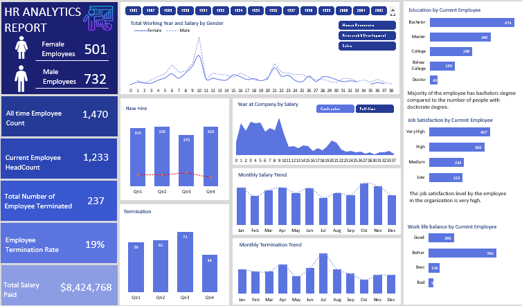

# Human Resource Analytics Report

## Introduction
This is an Excel project on employee analysis by a company's HR. The company's name is withheld. I sourced the dataset from Kaggle. The project is to derive insights from the employee data to enable the human resource manager to make informed decisions, improve organizational efficiency, and satisfy the workforce. 

## Problem Statement
1.	What is the total number of employees since inception						
2.	What is the Total number of our current employee						
3.	What is the total number of our terminated employee						
4.	What is our Employee Termination Rate						
5.	What is our total salary paid 						
6.	Our Current Employee by Gender						
7.	What is the level of our employee Education						
8.	How satisfied is our employee with their job						
9.	What is the rate of our employees' work-life balance
10.	Our Quarterly New Hires						
11.	Our Quarterly Terminations						
12.	Monthly Termination Trends						
13.	Monthly Salary trends						
14. Salary Spread by the number of years our Full-time employee or Contractor spent at the company						
15.	Salary Spread by Total Working  years of our employees by gender

## Skills Demonstrated
The Excel features used for the analysis include: 
Power Query, DAX, PivotTables, PivotCharts, Slicers, and Report connections.

## Analysis
This is a snippet of the report using a pivot table.

## Visualizations
The employee data is from 1985 to 2022. The Slicers and Report connections tools enable interactive data visualization. 

## Conclusion

- The low termination rate of 19% may suggest that the organization has a good strategy for retaining people. 

- There are more male employees than female employees in the company. 

- The majority of the current employees hold a bachelor's degree, while a smaller number hold doctorate degrees. 

- The employee's job satisfaction level is very high in the organization.

- Though the employees are highly satisfied with their jobs in the organization, they seem to lack work-life balance. The human resource department should look into the causation for the 
  efficient productivity of the company. 

- The third quarter of the year has a higher termination rate and a lower hiring rate. The termination rate is mostly in July.

- The number of employees who left the organization in July resulted in a minimum total salary payment. The organization paid the highest salary in October and November.

- Contractors and full-time employees with shorter tenure within the organization receive higher salary payments.

- Regardless of the number of stays at the organization, male employees receive higher pay than female employees.

  ## Recommendation

- The organization should adopt gender balance, equality, and fairness.
- To improve productivity, HR should organize webinars on the importance of work-life balance and implement some of the feedback from the questionnaire conducted on the causation 
    of low work-life balance.

  

  
  

